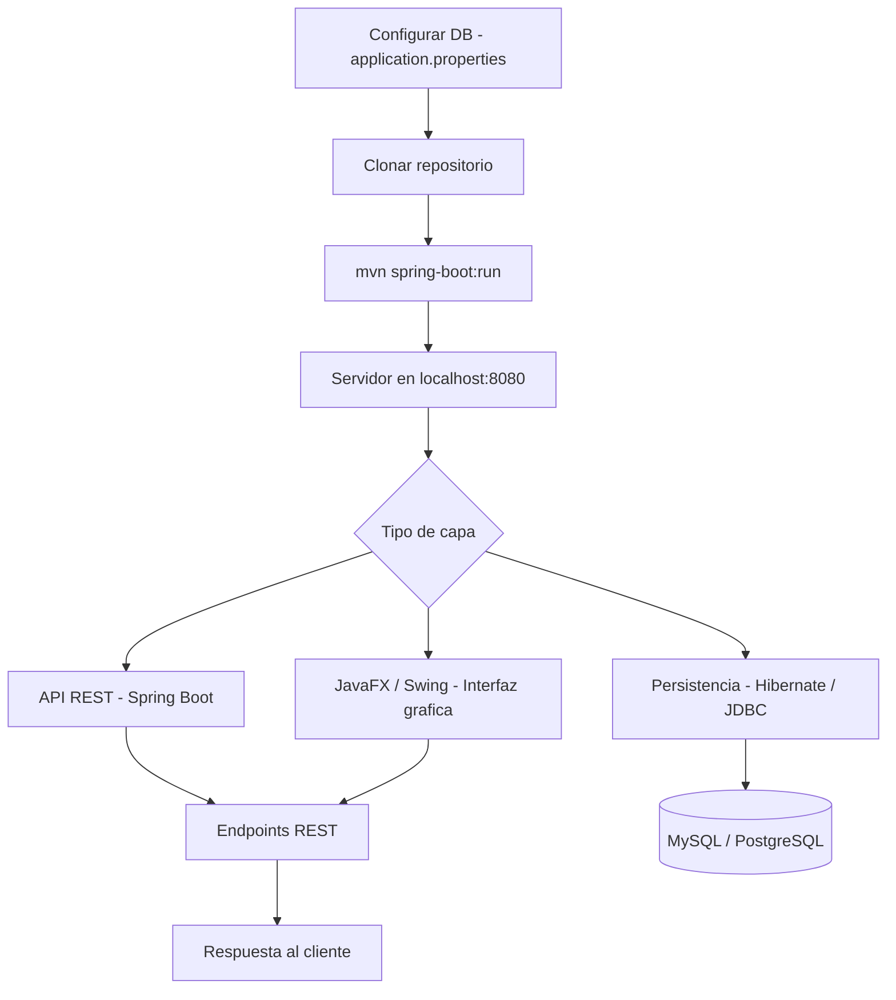

<div align="center">

# 📌 Desarrollo Java Postgrado  

## 📖 Descripción

</div>

---

Este proyecto abarca el desarrollo de aplicaciones en Java, incluyendo sistemas de escritorio, APIs REST y conexiones con bases de datos.

## 🛠️ Funcionalidades  
- Desarrollo de aplicaciones con Java SE y Java EE.  
- Creación de APIs REST con Spring Boot.  
- Conexión a bases de datos con Hibernate y JDBC.  
- Interfaces gráficas con JavaFX y Swing.  

## Arquitectura



## 🚀 Tecnologías utilizadas  
- Java  
- Spring Boot  
- Hibernate  
- MySQL / PostgreSQL  

## ▶️ Cómo ejecutar el proyecto  
1. Clonar el repositorio.  
2. Configurar la base de datos en `application.properties`.  
3. Ejecutar la aplicación con:  
   ```bash
   mvn spring-boot:run
   ```
4. Acceder a la API en `http://localhost:8080/`.  

## 📌 Autor  
👨‍💻 **Alejandro De Mendoza**

---

## Autor

**Alejandro De Mendoza**  
Ingeniero Informático · Especialista en IA · Especialista en Ingeniería de Software · Máster en Arquitectura de Software

[](https://github.com/AlejoTechEngineer)
